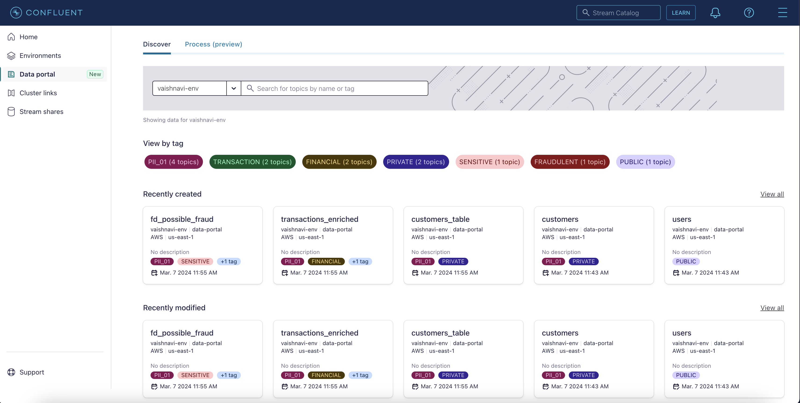
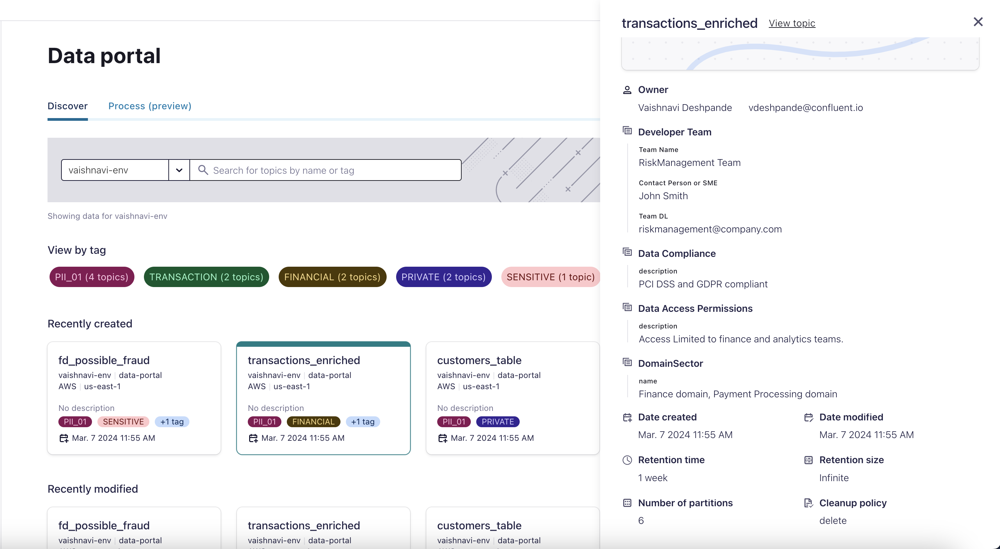
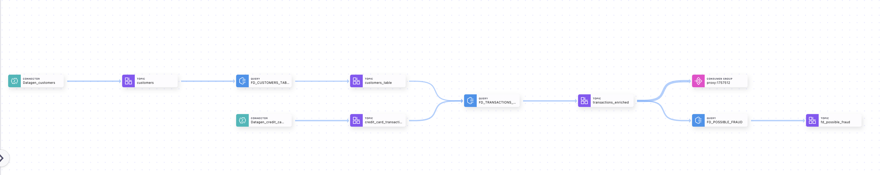

# Overview

This Terraform setup aims to facilitate the demonstration of a data portal for analyzing credit card transactions and detecting potential fraud, following the methodology outlined in [David's blog post](https://confluentinc.atlassian.net/wiki/spaces/PM/pages/3232631844/Demo+the+Data+portal).

This repository sets up a multiple resources for managing tags and business metadata in Confluent Schema Registry. Tags like "PII", "Security","Private" and "Financial" are created with corresponding descriptions. Tag bindings are established for various Kafka topics linking them to relevant tags. Additionally, business metadata definitions and bindings are set up to provide context about data sources, sinks, and access permissions.

# Pre-requisites
- User account on [Confluent Cloud](https://www.confluent.io/confluent-cloud/tryfree)
- Local install of [Terraform](https://www.terraform.io) (details below)
- Local install of [jq](https://jqlang.github.io/jq/download) (details below)
- Env and Schema registry setup on confluent cloud env

# Installation (only need to do that once)

## Install Terraform
```
brew tap hashicorp/tap
brew install hashicorp/tap/terraform
brew update
brew upgrade hashicorp/tap/terraform
```

## Install jq
```
brew install jq
```

# Provision services for the demo

## Set environment variables
- Create file `.env`
```
#!/bin/bash

# Confluent Cloud
export CONFLUENT_CLOUD_API_KEY=<SPECIFY YOUR CONFLUENT_CLOUD_API_KEY >
export CONFLUENT_CLOUD_API_SECRET=<SPECIFY YOUR CONFLUENT_CLOUD_API_SECRET >
export CC_ENV_ID=<SPECIFY YOUR ENVIRONMENT ID>
export CC_SR_ID=<SPECIFY YOUR SCHEMA REGISTRY ID>
```

## Start Demo
- Run command: `./demo_start.sh`
- Retreive and replace `cloud-ksqldb-url` ,`ksqldb-specific-api-key`,`ksqldb-specific-secret` from terraform output and replace it in `./shell/fraud_detection.sh`
- Run command: `./shell/fraud_detection.sh`
- Uncomment data_portal.tf 
- Run Command: `./demo_start.sh`

The Terraform code will also create Service Accounts, ACLs and API Keys

After setting up the environment , you could follow [David's blog post](https://confluentinc.atlassian.net/wiki/spaces/PM/pages/3232631844/Demo+the+Data+portal) and run the demo. Alternatively you can follow these steps :
1. Search and discover existing topics using tags , business metadata and various other filters.

2. Add yourself as owner and add your email to one of the topics to demo the request access feature. 

3. Create an alias account and add Data discovery role to that account for the current environment and demo the request access feature through that account.
4. Give the alias account a FlinkDeveloper role and clicking query on one of the topics and if a Flink pool is pre-created in the same region of the topic, run a simple select query in Flink and show the data..


# Scripts 
- `./demo_start.sh`: 
  - Script updates the timestamp in AVRO schema files for credit card transactions and prepares it for use as a strin, then initializes Terraform, plans and applies infrastructure changes, and retrieves Terraform outputs in JSON format.
- `./shell/fraud_detection.sh`:
  - Script automates the setup of ksqlDB streams and tables for analyzing credit card transactions, including joining transaction data with customer data and identifying potential fraud cases based on transaction amounts exceeding average credit spend within a specified timeframe.



# Terraform files
- `vars.tf`: Main system variables (change it as needed)
- `providers.tf`:
  - confluentinc/confluen
  - hashicorp/external (To read env variables)
- `main.tf`: 
  - Confluent Cloud Environment
  - Schema Registry
  - Apache Kafka Cluster
  - Service Accounts (app_manager, sr, clients)
  - Role Bindings (app_manager, sr, clients)
  - Credentials / API Keys (app_manager, sr, clients)
- `connectors.tf`:
  - Service Accounts (Connectors)
  - Access Control List
  - Credentials / API Keys
  - Create Kafka topics for the DataGen Connectors
  - DataGen Connectors
- `data_portal.tf`:
  - Create tags and business metadata after creation of KSQL queries.
  - Create tags and business  bindings for the topics


